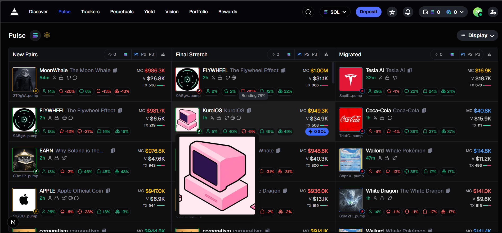
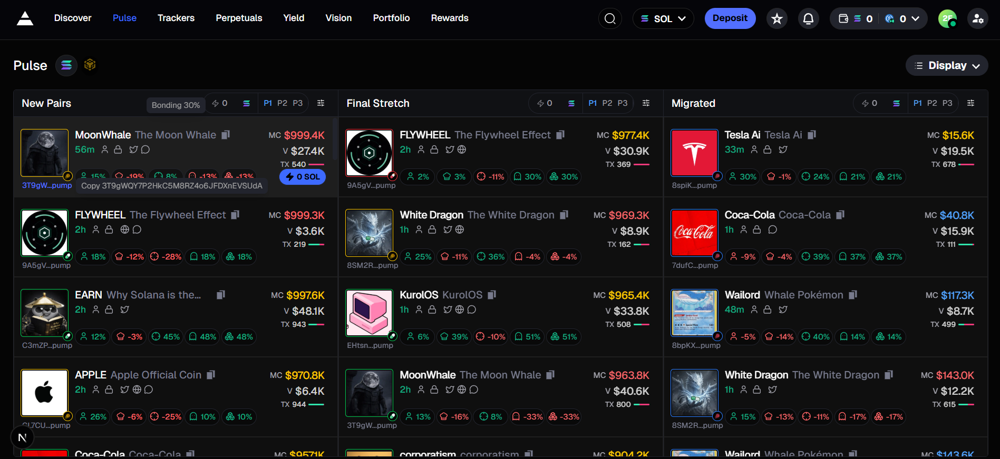

# Axiom Trade Replica – Token Discovery Board

A **high-performance token discovery interface** inspired by modern trading analytics dashboards.  
This project focuses on **fast-updating market data**, **clear visual hierarchy**, and a **three-lane board** for tracking tokens as they move through different lifecycle phases.

---

## 🖼️ Interface Preview

### Layout Screenshot 1


### Layout Screenshot 2


---

## ✨ Features

### 🔀 Three-Lane Token Board
Tokens are grouped into logical lanes (for example **New Pairs**, **Final Stretch**, **Migrated**) driven by a `status` field on each token object.

---

### ⚡ Simulated Live Market Feed
A mock WebSocket layer periodically updates:
- Price  
- Market cap  
- Volume  
- Percentage change  

This mimics **real-time market behavior** without relying on external APIs.

---

### 🧠 Render-Efficient Architecture
- **React Compiler** (configured in `next.config.ts`)
- Strategic use of `React.memo` in `TokenCard.tsx`

Ensures the UI remains responsive even with frequent data updates.

---

### 📊 Per-Column Sorting Controls
Each lane supports sorting by:
- Age  
- Market cap  
- Volume  
- Price change  

Sorting direction and criteria are stored in **Redux state** per column.

---

### 🌙 Dark Trading UI
Built using:
- **Tailwind CSS**
- **Shadcn-style UI components**

Includes:
- `Card`
- `Tooltip`
- `Popover`
- `Badge`
- `ScrollArea`
- `Button`

All styled to resemble a **professional dark trading environment**.

---

### 🔢 Readable Data Formatting
Utility helpers provide:
- Compact number formatting (K / M)
- Currency formatting
- Human-friendly timestamps via `formatTimeAgo`

---

## 🧰 Tech Stack

- **Next.js 16** (App Router)
- **TypeScript**
- **Tailwind CSS v4**
- **Radix UI primitives** wrapped as custom components  
  (`Card`, `Tooltip`, `Popover`, `ScrollArea`, `Button`, `Badge`)
- **Lucide React** for icons
- **React Compiler** for automatic memoization
- **Geist Sans** & **Geist Mono** (Vercel fonts)

---

## 🚀 Getting Started

### Install dependencies
```bash
npm install
# or
yarn install
# or
pnpm install
# or
bun install
```

## 🗂️ Key Files & Architecture

| Path | Description |
|------|-------------|
| `src/app/page.tsx` | Main screen composition, including header actions and the token board container |
| `src/components/ui/TokenTable/TokenTable.tsx` | Connects mock data, hooks up the WebSocket simulator, and renders the three token lanes |
| `src/components/ui/TokenTable/TokenColumn.tsx` | Column component responsible for sorting and lane-specific behavior via Redux |
| `src/components/ui/TokenTable/TokenCard.tsx` | Individual token card with a subtle visual flash when price data changes |
| `src/lib/mockData.ts` | Functions such as `generateMockTokens` used for building the initial dataset |
| `src/services/websocketMock.ts` | Local service that simulates a WebSocket stream with timed updates |
| `src/app/globals.css` | Global styling, Tailwind base layers, and the custom dark color system |
